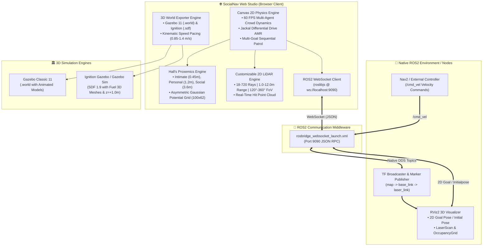

# 🤖 SocialNav Studio

<div align="center">

[](https://docs.ros.org/)
[](https://developer.mozilla.org/)
[](#-3d-gazebo-classic--ignition-gazebo-simulation-suite)
[](LICENSE)

**A high-fidelity, web-native Social Robot Navigation Simulation Studio, Proxemics Costmap Lab, and ROS2 / RViz2 / Gazebo Digital Twin Suite.**

[Features](#-key-features) • [Architecture](#-system-architecture) • [Quickstart](#-quickstart-guide) • [ROS2 & RViz2](#-ros2--rviz2-integration) • [Gazebo 3D Simulation](#-3d-gazebo-classic--ignition-gazebo-simulation-suite) • [Benchmark Datasets](#-public-crowd-trajectory-benchmarks) • [CLI Terminal](#-interactive-robotics-terminal-cli-devrobot_cli)

</div>

---

## 🌟 Overview

**SocialNav Studio** is an open-source, interactive simulation environment and robotics prototyping laboratory designed for researchers, roboticists, and engineers working on **Human-Aware Robot Navigation**, **Social Force Models (SFM)**, **Proxemics Costmaps**, and **Deep Reinforcement Learning (DRL)**.

Built entirely with high-performance Vanilla ES6+ and 60 FPS HTML5 Canvas physics, it provides real-time multi-agent crowd dynamics, customizable 2D LiDAR raycasting, dynamic Proxemics costmap generation, bidirectional ROS2 WebSocket bridging, and one-click export to **Gazebo Classic 11 (`.world`)** and **Ignition Gazebo / Gazebo Sim (`.sdf`)** with authentic benchmark trajectories.

---

## 🏗️ System Architecture



---

## ⚡ Key Features

### 1. 🚶‍♂️ Interactive Multi-Agent Crowd Simulation
* **Real-time 60 FPS Physics**: Simulates autonomous crowd encounters, group walking, cross flows, bottle-necks, and reciprocal yielding.
* **Jackal AMR Platform**: Differential drive mobile robot kinematics with continuous heading orientation and velocity integration.
* **Multi-Goal Sequential Waypoint Navigation**: Set and cycle through multi-goal patrol waypoints with loop modes and instant target switching.
* **Interactive Tool Palette**: *Drag / Select*, *Spawn Human*, *Place Static Obstacle Pillar*, *Set Goal Flag*, and *Reposition Robot*.

### 2. 🛡️ Hall's Proxemics & Asymmetric Gaussian Costmaps
* Visualizes Edward T. Hall's classic proxemics zones:
  * **Intimate Zone** ($r \le 0.45\text{m}$): Immediate physical boundary.
  * **Personal Zone** ($0.45\text{m} < r \le 1.20\text{m}$): Conversational and comfort space.
  * **Social Zone** ($1.20\text{m} < r \le 3.60\text{m}$): Interpersonal awareness area.
* **Dynamic Asymmetric Gaussian Costmap**: Generates a continuous cost matrix ($100 \times 62$ cells @ $0.2\text{m}$ resolution) expanded in front of walking pedestrians to penalize cutting across human paths. Published in real time to `/social_costmap`.

### 3. 📡 LiDAR Sensor Raycasting & Point Cloud
* **Fully Customizable Parameters**:
  * **Ray Count**: $18$ to $720$ beams (default: $360$ rays, $1^\circ$ resolution).
  * **Max Range**: $1.0\text{m}$ to $12.0\text{m}$ (default: $6.0\text{m}$).
  * **Field of View (FoV)**: $360^\circ$ (Omnidirectional), $270^\circ$, $180^\circ$, or $120^\circ$.
  * **Display Modes**: Toggleable beam lines and electric azure / cobalt blue hit return points.
* Live dynamic broadcasting to native ROS2 `sensor_msgs/msg/LaserScan` with synchronized `angle_min`, `angle_max`, and `ranges[]`.

### 4. 🧠 Multi-Algorithm Motion Planning Benchmark Suite
* **Social Force Model (SFM)**: Helbing anisotropic socio-physical forces with right-hand passing bias.
* **Relational Graph DRL (SARL)**: Spatio-temporal self-attention graph anticipating human trajectories $1.5\text{s}$ into the future.
* **CADRL (MIT DRL)**: Value-network reciprocal multi-agent collision avoidance.
* **Social MPC**: Receding-horizon trajectory optimizer with 12-stage prediction horizon and comfort penalty.
* **Social-ORCA (RVO)**: Geometric half-plane velocity obstacle avoidance.
* **Non-Social A\***: Baseline naive path planner ignoring pedestrian proxemics zones.

### 5. 📊 Real-Time Telemetry & Safety Metrics
* **Social Compliance %**: Percentage of navigation time spent outside all human personal spaces.
* **Personal Space Violations**: Strict count and duration of human comfort intrusions.
* **Minimum Separation Distance**: Closest encounter distance to any pedestrian ($2$ decimal places).
* **Comfort Index**: Jerk and proxemic penalty integration score ($0 - 100\%$).
* **Metric Robot Pose**: Accurate SI coordinates $(x, y, \theta)$ formatted to $2$ decimal places.

---

## 🏛️ 3D Gazebo Classic & Ignition Gazebo Simulation Suite

Export any 2D scenario, benchmark dataset, or custom playground layout directly to **production-ready 3D Gazebo world files**:

| Feature | Gazebo Classic 11 (`.world`) | Ignition Gazebo / Gazebo Sim (`.sdf`) |
| :--- | :--- | :--- |
| **File Format** | SDF 1.6 / Classic World XML | SDF 1.8 / 1.9 Fuel Compatible |
| **Actor Mesh** | `walk.dae` local mesh | `https://fuel.gazebosim.org/.../walk.dae` |
| **Actor $z$-Offset** | $z = 0.0\text{m}$ (Ground Plane) | $z = +1.0\text{m}$ (Torso Centered Offset) |
| **Physics Setup** | ODE Physics Engine ($1000\text{Hz}$) | DART / Bullet Physics Plugin |
| **Goal Representation**| 3D Beacon Pad & Glowing Pole | 3D Visual Beacon & Multi-Goal Markers |
| **Robot Policy** | **Standalone 3D World** (Spawn robot via ROS2 launch file) | **Standalone 3D World** (Spawn robot via ROS2 launch file) |

### 🏃 Kinematic Speed & Timestamp Pacing Engine
* All exported `<actor>` trajectories are processed through a **Kinematic Speed Pacing Engine**:
  * Normalizes walking speeds strictly between **$0.85\text{ m/s}$ and $1.40\text{ m/s}$**, perfectly synchronized with the standard `walk.dae` stride cycle to **eliminate foot-sliding (moonwalking)** or unrealistic sprinting.
  * Calculates exact $\Delta t = \frac{d}{v_{\text{walk}}}$ for all waypoint transitions.
  * Filters micro-jittering points ($< 5\text{cm}$) and generates smooth loop-closure return paths back to the starting point.

```bash
# Launch Gazebo Classic 11 Simulation:
./ros2_bridge/launch_gazebo_sim.sh classic

# Launch Ignition Gazebo / Gazebo Sim:
./ros2_bridge/launch_gazebo_sim.sh ignition
```

---

## 📊 Public Crowd Trajectory Benchmarks

The project comes pre-loaded with genuine trajectory data from leading robotics and computer vision benchmarks located in `ros2_bridge/datasets/`:

| Dataset | Environment Description | Modality / Format | File Location |
| :--- | :--- | :--- | :--- |
| **ETH Univ** | ETH Zurich Main Building entrance with diagonal crossing streams | 8,908 frames (360 peds) | `ros2_bridge/datasets/eth_univ_standard.txt` |
| **ETH Hotel** | Tram station & sidewalk with dense stopping & waiting behavior | 6,544 frames (390 peds) | `ros2_bridge/datasets/eth_hotel_standard.txt` |
| **UCY Zara-01** | Shopping street with dense bidirectional human traffic | 5,024 frames (148 peds) | `ros2_bridge/datasets/ucy_zara01_standard.txt` |
| **UCY Zara-02** | Denser shopping avenue with multi-directional group avoidance | 9,537 frames (204 peds) | `ros2_bridge/datasets/ucy_zara02_standard.txt` |
| **UCY Students** | University campus square with non-linear crowd convergence | 21,846 frames (428 peds) | `ros2_bridge/datasets/ucy_students_standard.txt` |
| **Stanford JRDB Quad**| JackRabbot robot navigating outdoor plaza with conversational clusters | 3D LiDAR & 360° Vision | `ros2_bridge/datasets/jrdb_quad_real.txt` |
| **Stanford JRDB Atrium**| Gates CS Building indoor corridors and lounge seating areas | Indoor 3D LiDAR | `ros2_bridge/datasets/jrdb_quad_real.txt` |
| **THÖR MoCap Lab** | Shared 2.2m laboratory corridor with human-robot reciprocal yielding | 3D MoCap & LiDAR | `ros2_bridge/datasets/thor_corridor_real.txt` |
| **ATC Shopping Mall** | Asia Pacific Trade Center dense crowd with window shoppers | Fixed 3D LiDAR Network | `ros2_bridge/datasets/atc_mall_real.txt` |
| **UT Austin SCAND** | Jackal & Spot robot navigation paths through campus plaza | Mobile Robot Teleop | `ros2_bridge/datasets/scand_plaza_real.txt` |
| **SDD Coupa** | Stanford Drone Dataset Coupa Cafe multi-stream campus plaza | 4K Drone Overhead | `ros2_bridge/datasets/sdd_coupa_sample.txt` |
| **inD Intersection**| Shared space roundabout intersection with pedestrians and cyclists | Drone Metric Trajectories | `ros2_bridge/datasets/ind_intersection_real.txt` |

*Supports custom `.txt` and `.csv` trajectory uploads in both 4-column format and raw 8-column EWAP observation matrix format (`obsmat.txt`).*

---

## 📡 ROS2 & RViz2 Integration

### 📤 Published Topics (Web Simulator $\rightarrow$ ROS2 / RViz2 @ 20 Hz)

| Topic Name | Message Type | Description |
| :--- | :--- | :--- |
| `/robot_pose` | `geometry_msgs/msg/PoseStamped` | Real-time position $(x, y)$ and quaternion orientation of the AMR robot in frame `map`. |
| `/odom` | `nav_msgs/msg/Odometry` | Simulated odometry feed with linear/angular velocities, position, and covariance in frame `odom` $\rightarrow$ `base_link`. |
| `/tracked_humans` | `geometry_msgs/msg/PoseArray` | Array of all active human pedestrian coordinates and heading orientations in frame `map`. |
| `/scan` | `sensor_msgs/msg/LaserScan` | Configurable 2D LiDAR point cloud in frame `laser_link` ($18 - 720$ rays, $1.0 - 12.0\text{m}$ range, $120^\circ - 360^\circ$ FoV). |
| `/social_costmap` | `nav_msgs/msg/OccupancyGrid` | 2D dynamic Social Costmap ($0.2\text{m/cell}$, asymmetric Gaussian proxemics + obstacle inflation @ 5 Hz). |
| `/goal_pose` | `geometry_msgs/msg/PoseStamped` | Current target navigation destination coordinates in frame `map` (Bidirectional sync). |

### 📥 Subscribed Topics (RViz2 / External Nodes $\rightarrow$ Web Simulator)

| Topic Name | Message Type | Description |
| :--- | :--- | :--- |
| `/goal_pose` | `geometry_msgs/msg/PoseStamped` | **2D Goal Pose** tool in RViz2 / Nav2 — updates single goal or overwrites the currently active waypoint in multi-goal mode. |
| `/cmd_vel` | `geometry_msgs/msg/Twist` | **Velocity Command** — incoming linear ($v_x$) and angular ($\omega_z$) velocities to control the robot from external ROS2 controllers. |
| `/clicked_point` | `geometry_msgs/msg/PointStamped` | **Publish Point** tool in RViz2 — moves the target goal flag. |
| `/initialpose` | `geometry_msgs/msg/PoseWithCovarianceStamped` | **2D Pose Estimate** tool in RViz2 — repositions the AMR robot on canvas. |

---

## 💻 Interactive Robotics Terminal CLI (`/dev/robot_cli`)

Control the simulation, inspect telemetry, echo ROS2 topics, and explore mathematical theory directly from the integrated terminal console:

```bash
# Simulation Control
sim algo <sfm | sarl | cadrl | mpc | orca | nonsocial>   # Switch motion planner
sim scenario <eth_univ | jrdb_quad | scand_plaza | ...>  # Load benchmark dataset
sim peds <2 - 20>                                        # Adjust pedestrian density
sim speed <0.4 - 3.0>                                    # Set robot max speed (m/s)
sim courtesy <0.1 - 2.0>                                 # Set yielding courtesy weight
sim lidar <on | off | rays N | range M | fov D>          # Tune LiDAR raycast
sim heatmap <on | off>                                   # Toggle Proxemics heatmap
sim pause | sim resume | sim reset                       # Control simulation loop
sim status                                               # Display live telemetry snapshot

# ROS2 Topic Tools
ros2 topic list                                          # List all active published & subscribed topics
ros2 topic echo <topic>                                  # Echo live frame (/robot_pose, /scan, /odom, etc.)

# Exporting 3D Gazebo Worlds
sim export <classic | ignition>                          # Download 3D .world or .sdf file

# Theoretical Formulations & Literature
theory <proxemics | sfm | sarl | benchmarks | datasets>   # View mathematical equations & citations

# UI Studio Customization
theme <dracula | tokyo | obsidian | solar_light | ...>   # Switch studio color theme
```

---

## 🚀 Quickstart Guide

### Prerequisites
* **Node.js** (v18.0+) & **npm**
* *(Optional for ROS2 / RViz2)*: ROS2 Humble, Iron, or Rolling with `ros-humble-rosbridge-server`

### 1. Clone & Run Web Studio Locally
```bash
# 1. Clone repository
git clone https://github.com/sontypo/social-nav-playground.git
cd social-nav-playground

# 2. Install dependencies
npm install

# 3. Start local development server (Vite @ port 5173)
npm run dev
```
Open your browser at **`http://localhost:5173/`**.

### 2. Connect Native ROS2 & RViz2
In separate terminals:
```bash
# Terminal 1: Launch WebSocket Bridge (Port 9090)
sudo apt install ros-humble-rosbridge-server
ros2 launch rosbridge_server rosbridge_websocket_launch.xml

# Terminal 2: Run TF Broadcaster & Launch RViz2
./ros2_bridge/launch_visualizer.sh
```
In the web studio, click **`Connect ROS2`** in the ROS2 Bridge deck. The status indicator will turn neon green (`ROS2 BRIDGE: CONNECTED`).

### 3. Build Production Bundle
```bash
npm run build
```

---

## 📂 Project Directory Structure

```
social-nav-playground/
├── index.html                      # Main Studio Single-Page Application
├── package.json                    # Project metadata & Vite build scripts
├── vite.config.js                  # Vite configuration & dev server settings
├── src/
│   ├── js/
│   │   ├── main.js                 # Application orchestrator & DOM bindings
│   │   ├── simulator.js            # 60 FPS Canvas physics, AMR kinematics & SFM
│   │   ├── ros2Bridge.js           # WebSocket bridge client (roslibjs)
│   │   ├── gazeboExporter.js       # 3D Gazebo Classic (.world) & Ignition (.sdf) engine
│   │   ├── terminal.js             # Interactive robotics CLI console engine
│   │   ├── data.js                 # Mathematical formulations, benchmarks & documentation
│   │   └── aiAssistant.js          # Built-in AI Robotics Assistant
│   └── styles/
│       ├── main.css                # Dracula Pro design tokens & global typography
│       ├── simulator.css           # Simulation canvas, HUD, toolbars & popovers
│       └── terminal.css            # Cyberpunk terminal console styling
└── ros2_bridge/
    ├── README.md                   # ROS2 integration guide & dataset documentation
    ├── launch_visualizer.sh        # One-click RViz2 & TF broadcaster launcher
    ├── launch_gazebo_sim.sh        # Gazebo Classic & Ignition simulation launcher
    ├── social_subscriber_example.py# Python TF Broadcaster & 3D Marker node
    ├── social_robot_controller.py  # Python velocity controller node
    ├── gazebo_human_controller.py  # Standalone Gazebo actor controller node
    ├── social_nav.rviz             # Pre-configured RViz2 display profile
    └── datasets/                   # Genuine crowd trajectory benchmark files
        ├── eth_univ_real.txt
        ├── eth_hotel_sample.txt
        ├── ucy_zara01_real.txt
        ├── jrdb_quad_real.txt
        ├── scand_plaza_real.txt
        ├── thor_corridor_real.txt
        ├── atc_mall_real.txt
        ├── sdd_coupa_sample.txt
        └── ind_intersection_real.txt
```

---

## 📜 Citation & References

If you use **SocialNav Studio** in your research, educational courses, or robotics benchmarking, please cite:

```bibtex
@misc{socialnav_studio_2026,
  author = {Hong Son Nguyen},
  title = {SocialNav Studio: Interactive Physics, Proxemics Costmap, and ROS2/Gazebo Simulation Engine},
  year = {2026},
  publisher = {GitHub},
  howpublished = {\url{https://github.com/sontypo/social-nav-playground}}
}
```

### Key Literature
* **Hall, E. T.** (1966). *The Hidden Dimension*. Anchor Books.
* **Helbing, D., & Molnar, P.** (1995). *Social force model for pedestrian dynamics*. Physical Review E, 51(5), 4282.
* **Chen, C., et al.** (2019). *Relational Graph Learning for Crowd Navigation*. IEEE Robotics and Automation Letters (RA-L).
* **Pellegrini, S., et al.** (2009). *You'll never walk alone: Modeling social behavior for multi-target tracking*. ICCV.
* **Lerner, A., et al.** (2007). *Crowds by example*. Computer Graphics Forum (Eurographics).
* **Martín-Martín, R., et al.** (2021). *JRDB: A Dataset and Benchmark of Egocentric Robot Navigation in Crowds*. CVPR.
* **Karnan, H., et al.** (2022). *SCAND: Socially Compliant Navigation Dataset*. IEEE RA-L.

---

## 📄 License

This project is licensed under the **BSD 3-Clause License** — see the [LICENSE.txt](LICENSE.txt) file for details.
