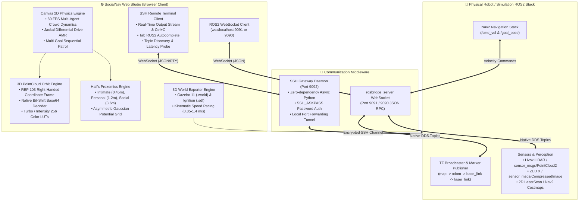

# 🤖 SocialNav Studio

<div align="center">

[](https://docs.ros.org/)
[](https://developer.mozilla.org/)
[](#-3d-gazebo-classic--ignition-gazebo-simulation-suite)
[](#-remote-ssh-robot-manager--interactive-terminal)
[](LICENSE.txt)

**A high-fidelity, web-native Social Robot Navigation Simulation Studio, Proxemics Costmap Lab, Live ROS2 Telemetry / 3D PointCloud Visualizer, and Gazebo Digital Twin Suite.**

[Live Demo & Modes](#-modes-of-operation) • [Key Features](#-key-features) • [System Architecture](#-system-architecture) • [Quickstart Guide](#-quickstart-guide) • [ROS2 & RViz2 Integration](#-ros2--rviz2-integration) • [SSH Remote Terminal](#-remote-ssh-robot-manager--interactive-terminal) • [Gazebo 3D Exporter](#-3d-gazebo-classic--ignition-gazebo-simulation-suite) • [Benchmark Datasets](#-public-crowd-trajectory-benchmarks)

</div>

---

## 🌟 Overview

**SocialNav Studio** is an open-source, dual-mode robotics prototyping studio designed for researchers, roboticists, and engineers working on **Human-Aware Robot Navigation**, **Social Force Models (SFM)**, **Proxemics Costmaps**, **Deep Reinforcement Learning (DRL)**, and **Live Physical Robot Teleoperation**.

The application operates in two synchronized modes:
1. **Simulation Studio (`index.html`)**: Web-native 60 FPS crowd dynamics simulator, multi-agent physics, custom 2D LiDAR raycasting, Proxemics costmap generation, and one-click export to **Gazebo Classic 11 (`.world`)** and **Ignition Gazebo / Gazebo Sim (`.sdf`)**.
2. **Live Hardware Stream Studio (`live.html`)**: Real-time ROS2 hardware visualizer supporting 3D LiDAR point clouds (Livox Mid-360, Velodyne, Ouster), RGB-D FPV cameras (ZED X, RealSense), 2D laser scans, automated ROS2 topic discovery, and an integrated **Interactive Remote SSH Linux Terminal**.

---

## 🎮 Modes of Operation

```
┌──────────────────────────────────────────────────────────────────────────────────┐
│                             🤖 SOCIALNAV STUDIO SUITE                            │
├────────────────────────────────────────┬─────────────────────────────────────────┤
│    🌐 MODE 1: SIMULATION STUDIO        │      📡 MODE 2: LIVE STREAM STUDIO      │
│            (index.html)                │               (live.html)               │
├────────────────────────────────────────┼─────────────────────────────────────────┤
│ • 60 FPS Multi-Agent Crowd Physics     │ • 3D PointCloud Orbit View (RViz2 Like) │
│ • SFM, SARL, CADRL, Social MPC, ORCA   │ • 2D Hardware Map & Odometry View       │
│ • Edward T. Hall Proxemics Costmaps    │ • Livox Mid-360 / ZED X Camera Stream   │
│ • Customizable 2D LiDAR Raycasting     │ • Auto-Detect & Remap ROS2 Topics       │
│ • Multi-Goal Sequential Patrol Paths   │ • Real-Time Packet & Hz Rate Monitor    │
│ • Export Gazebo 11 & Ignition SDF      │ • Built-in Remote SSH Interactive PTY   │
│ • Public Benchmark Datasets (ETH/JRDB) │ • Instant 2D Nav Goal & Teleop Joystick │
└────────────────────────────────────────┴─────────────────────────────────────────┘
```

---

## 🏗️ System Architecture



---

## ⚡ Key Features

### 1. 🌈 Real-Time 3D PointCloud & Hardware Visualizer (Live Stream Mode)
* **Dual Viewport Modes**:
  * **🌐 3D Orbit View**: Full 3D point cloud orbit camera with intuitive rotation (Left Drag), pan (Right Drag / Shift Drag), and zoom (Wheel) aligned with **ROS REP 103 Right-Handed coordinates** ($+X$ Forward, $+Y$ Left, $+Z$ Up).
  * **🗺️ 2D Map View**: Overhead metric map view displaying SLAM OccupancyGrid (`/map`), Global/Local Costmaps, and Nav2 trajectory plans.
* **High-Performance Decoding**:
  * Native bit-shift `base64ToUint8Array` binary decoder operating at **60 FPS** with zero GC memory pressure.
  * Pre-computed **Turbo Height LUT** and **Intensity LUT** (256-entry colormaps).
  * Configurable **Persistence Decay** ($0\text{s}$ instant up to $5.0\text{s}$ dense map accumulation).
* **Topic Inspector & Packet Monitor**:
  * Real-time packet counter, bandwidth (kB/s), and update frequency (Hz) for every incoming ROS2 topic.
  * **Auto Topic Discovery**: Queries active ROS2 topics from the robot, resolves types (`sensor_msgs/msg/PointCloud2`, `sensor_msgs/msg/CompressedImage`, `nav_msgs/msg/Odometry`), and auto-maps them to visualizer pipelines.
  * **Dynamic Topic Manager**: Add custom topics on the fly or remove unwanted streams with instant $0\text{ms}$ canvas purging.
  * **`[ 🧹 Clear ]` Tool**: One-click purge to clean all visualizer canvas layers (point clouds, scans, paths, trails, and humans).

---

### 2. 💻 Remote SSH Robot Manager & Interactive Terminal
* **Zero-Dependency Python Gateway Daemon (`remote_ssh_manager.py`)**:
  * Asynchronous WebSocket gateway running locally on `ws://localhost:9092`.
  * Multi-profile credential manager supporting Password and SSH Key authentication.
  * Headless password injection via `SSH_ASKPASS` provider (`askpass.py`), completely eliminating local PC terminal prompts.
  * Automatic SSH port forwarding tunnel (`-L 9091:localhost:9091`) for seamless rosbridge bridging.
* **Full-Featured Linux PC Terminal Console**:
  * **Real-Time Streaming Output**: Streams live output line-by-line for continuous commands (`ros2 topic echo`, `ros2 topic hz`, `ping`, `colcon build`, `htop`).
  * **`Ctrl + C` Interrupt (SIGINT)**: Interrupt any remote process instantly via the `Ctrl+C` keyboard shortcut or the `[ 🛑 Ctrl+C ]` UI button.
  * **Tab Autocompletion**: Auto-completes standard ROS2 commands (`ros2 topic list -t`, `ros2 topic echo`, `ros2 node list`, `ros2 launch`, etc.).
  * **Command History**: Navigate previous commands with `↑` and `↓` arrow keys.
  * **Convenience Controls**: `[ 🧪 Test Connection ]` latency probing, `[ 📋 Copy Output ]`, and `[ 🧹 Clear ]`.

---

### 3. 🚶‍♂️ Interactive Multi-Agent Crowd Simulation (Simulation Mode)
* **Real-time 60 FPS Physics**: Simulates autonomous crowd encounters, group walking, cross flows, bottle-necks, and reciprocal yielding.
* **Jackal Differential Drive AMR**: Realistic kinematics with continuous orientation heading and velocity integration.
* **Multi-Goal Sequential Waypoint Navigation**: Set and cycle through multi-goal patrol waypoints with loop modes and instant target switching.
* **Interactive Tool Palette**: *Drag / Select*, *Spawn Human*, *Place Static Obstacle Pillar*, *Set Goal Flag*, and *Reposition Robot*.

---

### 4. 🛡️ Hall's Proxemics & Asymmetric Gaussian Costmaps
* Visualizes Edward T. Hall's classic proxemics zones:
  * **Intimate Zone** ($r \le 0.45\text{m}$): Immediate physical boundary.
  * **Personal Zone** ($0.45\text{m} < r \le 1.20\text{m}$): Conversational and comfort space.
  * **Social Zone** ($1.20\text{m} < r \le 3.60\text{m}$): Interpersonal awareness area.
* **Dynamic Asymmetric Gaussian Costmap**: Generates a continuous cost matrix ($100 \times 62$ cells @ $0.2\text{m}$ resolution) expanded in front of walking pedestrians to penalize cutting across human paths. Published in real time to `/social_costmap`.

---

### 5. 🧠 Multi-Algorithm Motion Planning Benchmark Suite
* **Social Force Model (SFM)**: Helbing anisotropic socio-physical forces with right-hand passing bias.
* **Relational Graph DRL (SARL)**: Spatio-temporal self-attention graph anticipating human trajectories $1.5\text{s}$ into the future.
* **CADRL (MIT DRL)**: Value-network reciprocal multi-agent collision avoidance.
* **Social MPC**: Receding-horizon trajectory optimizer with 12-stage prediction horizon and comfort penalty.
* **Social-ORCA (RVO)**: Geometric half-plane velocity obstacle avoidance.
* **Non-Social A\***: Baseline naive path planner ignoring pedestrian proxemics zones.

---

## 🏛️ 3D Gazebo Classic & Ignition Gazebo Simulation Suite

Export any 2D scenario, benchmark dataset, or custom playground layout directly to **production-ready 3D Gazebo world files**:

| Feature | Gazebo Classic 11 (`.world`) | Ignition Gazebo / Gazebo Sim (`.sdf`) |
| :--- | :--- | :--- |
| **File Format** | SDF 1.6 / Classic World XML | SDF 1.8 / 1.9 Fuel Compatible |
| **Actor Mesh** | `walk.dae` local mesh | `https://fuel.gazebosim.org/.../walk.dae` |
| **Actor $z$-Offset** | $z = 0.0\text{m}$ (Ground Plane) | $z = +1.0\text{m}$ (Torso Centered Offset) |
| **Physics Setup** | ODE Physics Engine ($1000\text{Hz}$) | DART / Bullet Physics Plugin |
| **Goal Representation**| 3D Beacon Pad & Glowing Pole | 3D Visual Beacon & Multi-Goal Markers |
| **Kinematic Pacing**| Strict $0.85 - 1.40\text{ m/s}$ (Eliminates foot-sliding) | Strict $0.85 - 1.40\text{ m/s}$ (Eliminates foot-sliding) |

```bash
# Launch Gazebo Classic 11 Simulation:
./ros2_bridge/launch_gazebo_sim.sh classic

# Launch Ignition Gazebo / Gazebo Sim:
./ros2_bridge/launch_gazebo_sim.sh ignition
```

---

## 📊 Public Crowd Trajectory Benchmarks

Pre-loaded with authentic trajectory datasets located in `ros2_bridge/datasets/`:

| Dataset | Environment Description | Modality / Format | File Location |
| :--- | :--- | :--- | :--- |
| **ETH Univ** | ETH Zurich Main Building entrance with diagonal crossing streams | 8,908 frames (360 peds) | `ros2_bridge/datasets/eth_univ_standard.txt` |
| **ETH Hotel** | Tram station & sidewalk with dense stopping & waiting behavior | 6,544 frames (390 peds) | `ros2_bridge/datasets/eth_hotel_standard.txt` |
| **UCY Zara-01** | Shopping street with dense bidirectional human traffic | 5,024 frames (148 peds) | `ros2_bridge/datasets/ucy_zara01_standard.txt` |
| **UCY Zara-02** | Denser shopping avenue with multi-directional group avoidance | 9,537 frames (204 peds) | `ros2_bridge/datasets/ucy_zara02_standard.txt` |
| **UCY Students** | University campus square with non-linear crowd convergence | 21,846 frames (428 peds) | `ros2_bridge/datasets/ucy_students_standard.txt` |
| **Stanford JRDB Quad**| JackRabbot robot navigating outdoor plaza with conversational clusters | 3D LiDAR & 360° Vision | `ros2_bridge/datasets/jrdb_quad_real.txt` |
| **Stanford JRDB Atrium**| Gates CS Building indoor corridors and lounge seating areas | Indoor 3D LiDAR | `ros2_bridge/datasets/jrdb_quad_real.txt` |
| **THÖR MoCap Lab** | Shared 2.2m laboratory corridor with human-robot reciprocal yielding | 3D MoCap & LiDAR | `ros2_bridge/datasets/thor_corridor_real.txt` |
| **ATC Shopping Mall** | Asia Pacific Trade Center dense crowd with window shoppers | Fixed 3D LiDAR Network | `ros2_bridge/datasets/atc_mall_real.txt` |
| **UT Austin SCAND** | Jackal & Spot robot navigation paths through campus plaza | Mobile Robot Teleop | `ros2_bridge/datasets/scand_plaza_real.txt` |
| **SDD Coupa** | Stanford Drone Dataset Coupa Cafe multi-stream campus plaza | 4K Drone Overhead | `ros2_bridge/datasets/sdd_coupa_sample.txt` |
| **inD Intersection**| Shared space roundabout intersection with pedestrians and cyclists | Drone Metric Trajectories | `ros2_bridge/datasets/ind_intersection_real.txt` |

*Supports custom `.txt` and `.csv` trajectory uploads in both 4-column format and raw 8-column EWAP observation matrix format (`obsmat.txt`).*

---

## 📡 ROS2 & RViz2 Integration

### 📤 Published Topics (Web $\rightarrow$ ROS2 @ 20 Hz)

| Topic Name | Message Type | Description |
| :--- | :--- | :--- |
| `/robot_pose` | `geometry_msgs/msg/PoseStamped` | Real-time position $(x, y)$ and quaternion orientation of the AMR robot in frame `map`. |
| `/odom` | `nav_msgs/msg/Odometry` | Simulated odometry feed with velocities, position, and covariance in frame `odom` $\rightarrow$ `base_link`. |
| `/tracked_humans` | `geometry_msgs/msg/PoseArray` | Array of all active human pedestrian coordinates and heading orientations in frame `map`. |
| `/scan` | `sensor_msgs/msg/LaserScan` | Configurable 2D LiDAR point cloud in frame `laser_link` ($18 - 720$ rays, $1.0 - 12.0\text{m}$ range). |
| `/social_costmap` | `nav_msgs/msg/OccupancyGrid` | 2D dynamic Social Costmap ($0.2\text{m/cell}$, asymmetric Gaussian proxemics @ 5 Hz). |
| `/goal_pose` | `geometry_msgs/msg/PoseStamped` | Current target navigation destination coordinates in frame `map` (Bidirectional sync). |

### 📥 Subscribed Topics (RViz2 / External Nodes $\rightarrow$ Web Simulator)

| Topic Name | Message Type | Description |
| :--- | :--- | :--- |
| `/goal_pose` | `geometry_msgs/msg/PoseStamped` | **2D Goal Pose** tool in RViz2 / Nav2 — updates single goal or overwrites the currently active waypoint in multi-goal mode. |
| `/cmd_vel` | `geometry_msgs/msg/Twist` | **Velocity Command** — incoming linear ($v_x$) and angular ($\omega_z$) velocities to control the robot from external ROS2 controllers. |
| `/clicked_point` | `geometry_msgs/msg/PointStamped` | **Publish Point** tool in RViz2 — moves the target goal flag. |
| `/initialpose` | `geometry_msgs/msg/PoseWithCovarianceStamped` | **2D Pose Estimate** tool in RViz2 — repositions the AMR robot on canvas. |

---

## 💻 Interactive Robotics Terminal CLI (`/dev/robot_cli`)

Control the simulation, inspect telemetry, echo ROS2 topics, and explore mathematical theory directly from the integrated terminal console:

```bash
# Simulation Control
sim algo <sfm | sarl | cadrl | mpc | orca | nonsocial>   # Switch motion planner
sim scenario <eth_univ | jrdb_quad | scand_plaza | ...>  # Load benchmark dataset
sim peds <2 - 20>                                        # Adjust pedestrian density
sim speed <0.4 - 3.0>                                    # Set robot max speed (m/s)
sim courtesy <0.1 - 2.0>                                 # Set yielding courtesy weight
sim lidar <on | off | rays N | range M | fov D>          # Tune LiDAR raycast
sim heatmap <on | off>                                   # Toggle Proxemics heatmap
sim pause | sim resume | sim reset                       # Control simulation loop
sim status                                               # Display live telemetry snapshot

# ROS2 Topic Tools
ros2 topic list                                          # List all active published & subscribed topics
ros2 topic echo <topic>                                  # Echo live frame (/robot_pose, /scan, /odom, etc.)

# Exporting 3D Gazebo Worlds
sim export <classic | ignition>                          # Download 3D .world or .sdf file

# Theoretical Formulations & Literature
theory <proxemics | sfm | sarl | benchmarks | datasets>   # View mathematical equations & citations

# UI Studio Customization
theme <dracula | tokyo | obsidian | solar_light | ...>   # Switch studio color theme
```

---

## 🚀 Quickstart Guide

### Prerequisites
* **Node.js** (v18.0+) & **npm**
* *(Optional for ROS2)*: ROS2 Humble, Iron, or Jazzy with `ros-humble-rosbridge-server`

### 1. Clone & Run Web Studio Locally
```bash
# 1. Clone repository
git clone https://github.com/sontypo/social-nav-playground.git
cd social-nav-playground

# 2. Install dependencies
npm install

# 3. Start local development server (Vite @ port 5173)
npm run dev
```
* Main Simulation Studio: **`http://localhost:5173/`**
* Live Hardware Stream Studio: **`http://localhost:5173/live.html`**

### 2. Launching Live Stream & SSH Gateway
```bash
# Terminal 1: Launch Local SSH Bridge Daemon (Port 9092)
./ros2_bridge/launch_ssh_bridge.sh

# Terminal 2 (Optional Demo): Run synthetic 3D LiDAR & AMR telemetry node
./ros2_bridge/launch_live_stream_demo.sh
```

### 3. Launching RViz2 Visualizer (For `Simulation Mode` only)
```bash
./ros2_bridge/launch_visualizer.sh
```
In the web studio, click **`Connect ROS2`** in the ROS2 Bridge deck. The status indicator will turn neon green (`ROS2 BRIDGE: CONNECTED`).

### 4. Build Production Bundle
```bash
npm run build
```

---

## 📂 Project Directory Structure

```
social-nav-playground/
├── index.html                      # Main Studio Simulation & Scenario Editor
├── live.html                       # Real-Time ROS2 Hardware Live Stream Studio
├── package.json                    # Project metadata & Vite build scripts
├── vite.config.js                  # Vite configuration & multi-page dev server settings
├── src/
│   ├── js/
│   │   ├── main.js                 # Application orchestrator & DOM bindings
│   │   ├── simulator.js            # 60 FPS Canvas physics, AMR kinematics & SFM
│   │   ├── liveStream.js           # Live ROS2 Telemetry, 3D Orbit & FPV Camera engine
│   │   ├── pointcloudDecoder.js    # Binary PointCloud2 decoder, Turbo colormap & 3D camera
│   │   ├── sshManager.js           # SSH Remote Robot Manager & Real-Time Interactive Terminal
│   │   ├── ros2Bridge.js           # Bidirectional ROS2 WebSocket bridge client
│   │   ├── gazeboExporter.js       # 3D Gazebo Classic (.world) & Ignition (.sdf) engine
│   │   ├── terminal.js             # Interactive robotics CLI console engine
│   │   ├── data.js                 # Mathematical formulations, benchmarks & documentation
│   │   └── aiAssistant.js          # Built-in AI Robotics Assistant
│   └── styles/
│       ├── main.css                # Dracula Pro design tokens & global typography
│       ├── simulator.css           # Simulation canvas, HUD, toolbars & popovers
│       ├── liveStream.css          # Live stream dashboard, 3D visualizer & SSH modal styling
│       └── terminal.css            # Cyberpunk terminal console styling
└── ros2_bridge/
    ├── README.md                   # ROS2 integration guide & dataset documentation
    ├── launch_visualizer.sh        # One-click RViz2 & TF broadcaster launcher
    ├── launch_gazebo_sim.sh        # Gazebo Classic & Ignition simulation launcher
    ├── launch_live_stream_demo.sh  # Autonomous AMR & 16-beam 3D LiDAR demo publisher
    ├── launch_ssh_bridge.sh        # Remote SSH Bridge Gateway & Tunnel Daemon launcher
    ├── remote_ssh_manager.py       # Zero-dependency async Python WebSocket SSH server
    ├── askpass.py                  # Headless SSH_ASKPASS credential provider
    ├── live_stream_publisher.py    # Python ROS2 synthetic 3D LiDAR & telemetry node
    ├── social_subscriber_example.py# Python TF Broadcaster & 3D Marker node
    ├── social_robot_controller.py  # Python velocity controller node
    ├── gazebo_human_controller.py  # Standalone Gazebo actor controller node
    ├── social_nav.rviz             # Pre-configured RViz2 display profile
    └── datasets/                   # Genuine crowd trajectory benchmark files
```

---

## 📜 Citation & References

If you use **SocialNav Studio** in your research, educational courses, or robotics benchmarking, please cite:

```bibtex
@misc{socialnav_studio_2026,
  author = {Hong Son Nguyen},
  title = {SocialNav Studio: Interactive Physics, Proxemics Costmap, and ROS2/Gazebo Simulation Engine},
  year = {2026},
  publisher = {GitHub},
  howpublished = {\url{https://github.com/sontypo/social-nav-playground}}
}
```

### Key Literature
* **Hall, E. T.** (1966). *The Hidden Dimension*. Anchor Books.
* **Helbing, D., & Molnar, P.** (1995). *Social force model for pedestrian dynamics*. Physical Review E, 51(5), 4282.
* **Chen, C., et al.** (2019). *Relational Graph Learning for Crowd Navigation*. IEEE Robotics and Automation Letters (RA-L).
* **Pellegrini, S., et al.** (2009). *You'll never walk alone: Modeling social behavior for multi-target tracking*. ICCV.
* **Lerner, A., et al.** (2007). *Crowds by example*. Computer Graphics Forum (Eurographics).
* **Martín-Martín, R., et al.** (2021). *JRDB: A Dataset and Benchmark of Egocentric Robot Navigation in Crowds*. CVPR.
* **Karnan, H., et al.** (2022). *SCAND: Socially Compliant Navigation Dataset*. IEEE RA-L.

---

## 📄 License

This project is licensed under the **BSD 3-Clause License** — see the [LICENSE.txt](LICENSE.txt) file for details.
